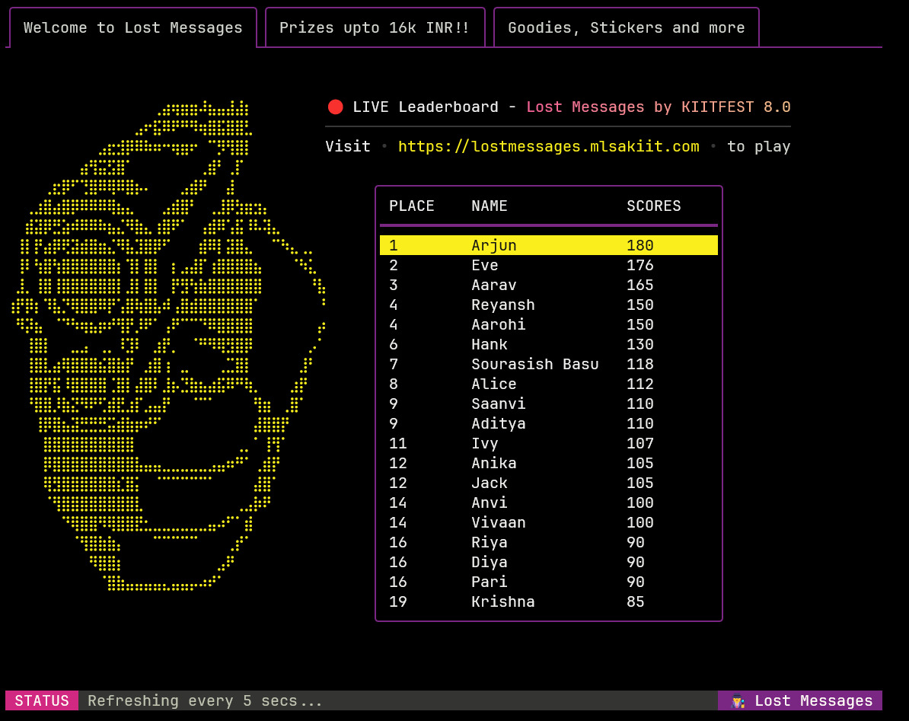

# TUI Live Leaderboard

> TUI based live leaderboard created for tracking participant scores for the Lost Messages event conducted by MLSAKIIT for KIITFEST 8.0.

## Prerequisites

- Golang v1.23+
- Postgres Database (NeonDB)

## Libraries Used

- pgx 
- SQLc
- Charmbracelet
    - Wish (SSH server)
    - Bubble Tea (TUI app framework)
    - Lip Gloss (TUI Styling)

## Usage

- Clone the repo and change to project directory.

```bash
git clone https://github.com/SourasishBasu/ssh-leaderboard.git
cd ./ssh-leaderboard/cmd/ssh-leaderboard/
touch .env
```
- Add the database connection string to `.env` file.

- Start the SSH server locally

```bash
go run ./ssh-leaderboard.go

# With Docker
docker run -d -v $(pwd)/.env:/app/.env -p 23234:23234 ghcr.io/sourasishbasu/leaderboard:latest
```

- SSH into the server from Terminal.

```bash
ssh localhost -p 23234
```

