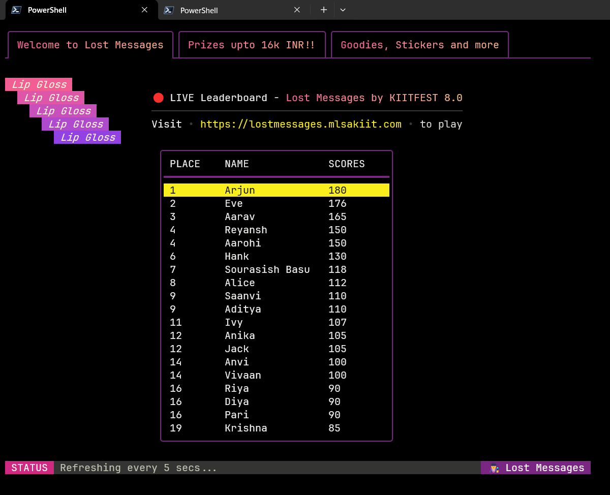

# TUI Live Leaderboard

> TUI based live leaderboard created for tracking participant scores for the Lost Messages event conducted by MLSAKIIT for KIITFEST 8.0

## Prerequisites

- Golang v1.23+
- Postgres Database (NeonDB)

## Libraries Used

- pgx 
- SQLc
- Charmbracelet
    - Wish (SSH server)
    - Bubble Tea (TUI app framework)
    - Lip Gloss (TUI Styling)

## Usage

- Add the database connection string to `.env` file.

- Start the SSH server

```bash
go run layout.go
```

- SSH into the server from Terminal.

```bash
ssh localhost -p 23234
```

